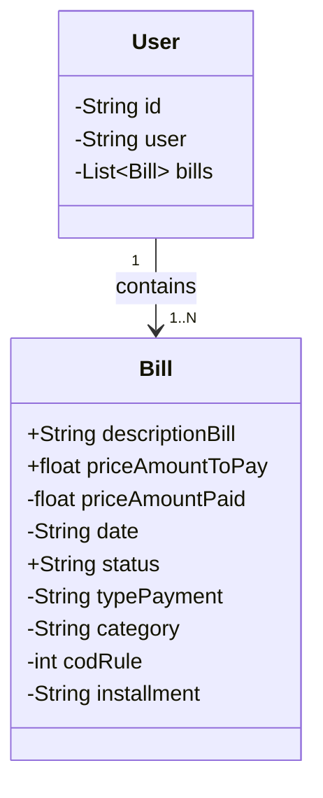

# Santander Dev Week 2024

Ultimo projeto Java RESTful API

## Diagrama de classes

```mermaid
 classDiagram
    class User {
        -String id
        -String user
        -List~Bill~ bills
    }
    
    class Bill {
        +String descriptionBill
        +float priceAmountToPay
        -float priceAmountPaid
        -String date
        +String status
        -String typePayment
        -String category
        -int codRule
        -String installment
    }
    
    User "1" --> "1..N" Bill : contains

```
